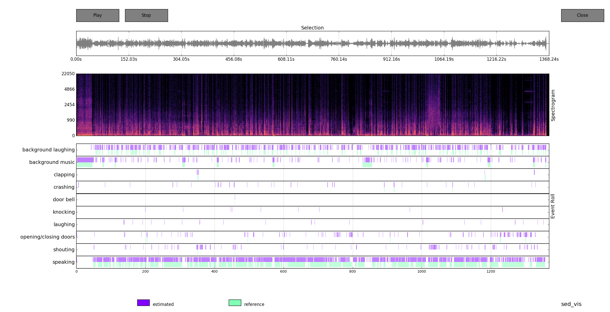

# Introduction
This repository contains source code in Tensorflow of a simple sound event detection (multi-label classification) model using CNN+RNN.

# Requirements
* Python 2.7
* Tensorflow 1.12
* Librosa 0.6
* Matplotlib 1.5.3
* [sed_vis](https://github.com/TUT-ARG/sed_vis)
* [dcase_utils](https://github.com/DCASE-REPO/dcase_util)

# Method 
## Data preparation
All the audio from the dataset will be extracted to WAV format at sampling rate 44100Hz (Cd quality) and bit depth is 16. Some of the episodes are used to train the detection model, and the rest are used as the test data. 
All audio of trainning and validation episodes are split to 1s clips with multiple labels. All the audio clips should be put in the same folder, i.e `audio_clips`.

For each clip, an annotation of the format: 
```<clip_name> \t<start time (ms)> \t<end time (ms)> \t<label1|label2...>` . For examples, `s01_ep01-090.wav    459000  460000  shouting|door bell```

All of the annotation lines for training clips should be write to a file, and annotations for validation in another file. The list of training and validation clips should be placed in `lists` directory.
For the test data, all the audio of the episodes are keep in their original form and put the the same folder (`audio_wav`). The file name of the test  files should be `s<season number>_ep<episode number>.wav`. (For example, `s01_ep08.wav`). The annotations should be placed in the same folder with their original name (`annotations`).

## Feature Extraction
Each fixed-length window of a mono audio signal is preprocessed by short-time Fourier transform (STFT) to produce its spectrogram. This spectorgram then is fed to a 2-D convolutional neural network (CNN) to extract deep features in a smaller height and width but deeper in number of channels. 
Due to the 2D-convolution in the CNN, a new channel dimension must be added to the spectrogram. Shape of the input: `<batch size> x <number of fft frames> x (N_FFT/2 + 1) x 1`
For example, with the parameter used in `vggish_rnn.py`, the shape of the extracted feature is `32 x 44 x 1025 x 1`

## Model architecture
### CNN as deep feature extractor
Instead of using mel frequency cesptral coefficients as the final feature, a CNN is used to extract deep features from the spectrogram. Basically, this CNN  follows the architecture of VGGISH at [AudioSet](https://github.com/tensorflow/models/tree/master/research/audioset) with some modifications. This CNN contains 7 3x3 convolution layers, average pooling, batch normalization layers. For more details, please refer to `model.py`.

### RNN as sequence classifier
A RNN takes the extracted features as the input then product the final output label. The activation of the output layer is `sigmoid`.

# Train, evaluate, inference and the 
## Train the model
If all the data is placed in the recommended directory, to train the model, run the following command:
```
python vggish_rnn.py
```
The data will be loaded by reading the lists in the `lists` folder then load the clips in the `audio_clips`. A folder named `checkpoint` will be created for the logging and saving the trained paramters.

## Evaluate the trained model:
To  evaluate the trained model on the provided data, run the following command:
```
python evaluate.py --checkpoint='checkpoint/vggish_rnn'
```

The trained model is saved in `checkpoint/vggish_rnn/model`, but the `--checkpoint` argument should point to `checkpoint/vggish_rnn` only. 

The python script will read all audio of episodes in the `audio_wav` folder and annoatations in the `annotations` folder.
The script will make prediction in the data then compare with the annotation to produce a table of accuracy, precision, recall,f1_score and intersection over union of each event type.

## Inference on a single file
To inference or evaluate with a single audio file:
```
python inference.py --checkpoint=<path to checkpoint folder> --input_file <input audio file in same format as the above-mentioned wav files? --output_file <output predictions, optional> --gt_file <ground truth file, optional>
```
The `input_file` argument is mandatory while the other two are optional. The script will load the trained model then infer on the input file and write the output to the `output_file`. If the `gt_file` is specified, the evaluation metrics will be printed out.

## Visualize the output
To visualize the predictions in sound event detection output:
```
python visualize.py --audio-file <The audio file has a prediction output> --ground-truth <ground truth file in the provided format> --prediction <prediction output> 
```
This script will display a window by matplotlib as the following figure:


# Result 
The above model is trained with audio data from 7 first episodes of Friends series then evaluated in the next 3 episodes. This data set is of high imbalance (10 classes, 3 dominant classes account more than 90% of the data). 
Main metric to measure the performance is `f1_score`.
Every second in the testing files and prediction results is compared as multi-label classification.

## Result folder: prediction_results
In this folder, there are only prediction results from episode 08 to 23 of the session 1 of Friends because the first 7 episodes are used as training data.
The format of the prediction results is similar to format of the original annotation excepts the start time and end time for each event is changed to second only (original format is hh:mm:ss). Example of the result format 
```
{
    "file_name": "s01_ep08.json",       //Name of the prediction file containing the season and episode number 
    "sound_results": [
        {
            "start_time": 0,             // Start time at second, in the original annotation was hh:mm:ss 
            "sound_type": "speaking",    // Label 
            "end_time": 2.0              // End time at second
        },
        ...
        ]
}
```
The above example shows the output  of a "speaking" event starting at 0 second and stopping at 2.0 second. 

|           | background music | speaking | background laughing |
|-----------|------------------|----------|---------------------|
| precision | 0.62             | 0.92     | 0.60                |
| recall    | 0.67             | 0.85     | 0.77                |
| f1        | 0.64             | 0.88     | 0.67                |

# Acknowledgements

This work was supported by Institute for Information & communications Technology Promotion(IITP) grant funded by the Korea government(MSIT) (2017-0-01780, The technology development for event recognition/relational reasoning and learning knowledge based system for video understanding)
